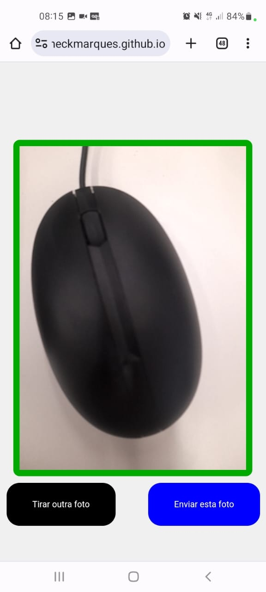

# Moldura da Câmera (Apenas JavaScript, HTML e CSS)

Este projeto apresenta uma aplicação de exemplo que permite aos usuários tirar fotos com uma moldura personalizada usando apenas JavaScript, HTML e CSS.

## Demonstração Online

Você pode experimentar a aplicação online acessando o seguinte link:
[Demo Online](https://heckmarques.github.io/moldura-camera-apenas-js-html-css/)

## Funcionalidades

- Utiliza a câmera do dispositivo para visualização ao vivo.
- Inclui um temporizador de contagem regressiva antes de tirar a foto.
- Mostra um título informativo e o temporizador acima da visualização da câmera.
- Permite ao usuário tirar uma foto com uma moldura personalizada.
- Após tirar a foto, exibe a foto capturada com a moldura.
- Oferece a opção de tirar mais fotos após a captura inicial.

**Nota**: A funcionalidade de envio de foto não está incluída no código.

## Imagem da Aplicação em Funcionamento

## Autor

- [Mauricio Heck Marques](https://github.com/HeckMarques)

